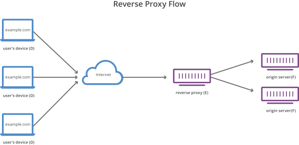

>   **Table of Contents** : 
>
> *[1. What is a reverse proxy?](#reverse_proxy)*  
> *[2. What is a forward proxy?](#forward_proxy)*   
> *[3. How is a reverse proxy different?](#difference)*  
> *[4. How to implement a reverse proxy?](#implementation)*   
>  

 
 

# 1. What is a reverse proxy? 

A **reverse proxy** is a server that sits in front of **web servers** and **forwards client** (e.g. web browser) **requests** to those web servers. Reverse proxies are typically implemented to help web server to increase it's **security**, **performance** and **reliability**

 
 

# 2. What is a forward proxy? 

A forward proxy, often called a **proxy**, **proxy server**, or **web proxy**, is a server that sits in front of a **group of client machines**. When those computers make requests to sites and services on the internet, the proxy server **intercepts** those requests and then **communicates** with web servers on behalf of those clients, like a **middleman**.

For example, let’s name 3 computers involved in a typical forward proxy communication:

- **A** : This is a user’s home computer
- **B** : This is a forward proxy server
- **C** : This is a website’s origin server (where the website data is stored)

 

 

In a **standard Internet communication**, computer **A** would reach out directly to computer **C**, with the client sending requests to the origin server and the origin server responding to the client. When a **forward proxy** is in place, **A** will instead send requests to **B**, which will then forward the request to **C**. **C** will then send a response to **B**, which will forward the response back to **A**.

**Why** would anyone add this extra middleman to their Internet activity? There are a few reasons one might want to use a **forward proxy**:

- **To avoid state or institutional browsing restrictions**: As the users can connect to the proxy rather than directly to the sites they are visiting.

- **To block access to certain content**: Forward proxy can enables content filtering rules that refuse to forward responses from Facebook and other social media sites back to the client computer.

- **To protect their identity online**: As only the IP address of the proxy server will be visible.

 
 

# 3. How is a reverse proxy different? 

The **difference** between a forward and reverse proxy is **subtle** but **important**. A simplified way the difference would be to say that a **forward proxy** sits in front of a client and ensures that **no origin server ever communicates directly with that specific client**. On the other hand, a **reverse proxy** sits in front of an origin server and ensures that **no client ever communicates directly with that origin server**.

Once again, let’s illustrate by naming the computers involved:

- **D** : Any number of users’ home computers
- **E** : This is a reverse proxy server
- **F** : One or more origin servers

 

 

Typically all requests from **D** would go directly to **F**, and **F** would send responses directly to **D**. With a reverse proxy, all requests from **D** will go directly to **E** and **E** will send its requests to and receive responses from **F**. **E** will then pass along the appropriate responses to **D**.

Below we **outline** some of the **benefits** of a **reverse proxy**:

- **Load balancing**: Means **distribution** of **incoming** traffic among a pool of **different servers**, all these servers will handle requests for the **same site**. A **reverse proxy** can provide a load balancing solution to **prevent** any single server from becoming **overloaded**. In the event that a server fails completely, other servers can step up to handle the traffic.

- **Protection from attacks**:  With a **reverse proxy** in place, a web site or service **never** needs to **reveal** the **IP address** of their origin server(s). This makes it much **harder** for attackers to **leverage** a targeted attack against them, such as a **DDoS** attack.

- **Global Server Load Balancing (GSLB)**: In this form of load balancing, a website can be distributed on several servers around the **globe** and the reverse proxy will send clients to the server that’s **geographically closest** to them. This **decreases** the **distances** that requests and responses need to travel, **minimizing** load times.

- **Caching**: A reverse proxy can also **cache content**, resulting in **faster** performance. 

 

**Ref** : [*cloudflare*](https://www.cloudflare.com/learning/cdn/glossary/reverse-proxy) 

---